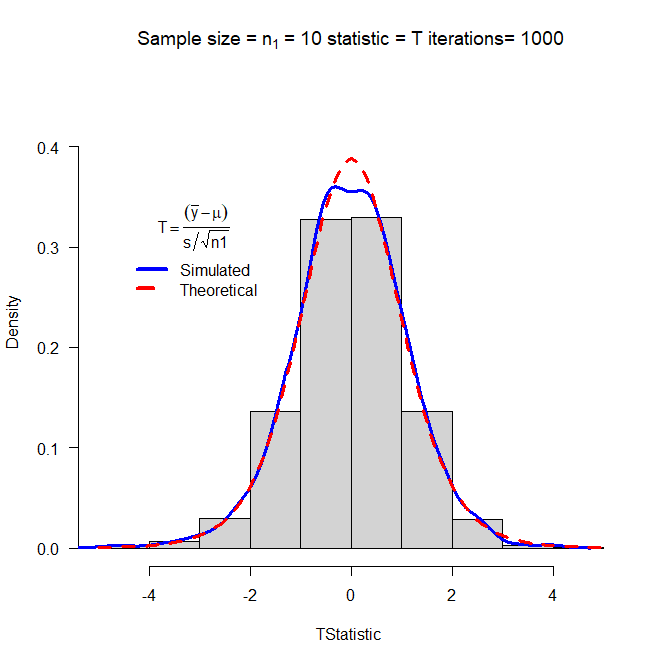

```{r setup, include=FALSE}
knitr::opts_chunk$set(echo = TRUE)
```

## Task 1

```{r}
getwd()
```

## Task 2

For the chi-square statistic, I modified the function so it would run in R-Markdown and created the plots below.

```{r}
mychisim<-function(n1=10,sigma1=3,mean1=5,iter=1000,ymax=0.1, x= 0, y =0,...){    # adjust ymax to make graph fit
  y1=rnorm(n1*iter,mean=mean1,sd=sigma1)# generate iter samples of size n1
  
  data1.mat=matrix(y1,nrow=n1,ncol=iter,byrow=TRUE) # Each column is a sample size n1
  
  ssq1=apply(data1.mat,2,var) # ssq1 is s squared
  
  w=(n1-1)*ssq1/sigma1^2      #chi-sq stat
  
  hist(w,freq=FALSE, ylim=c(0,ymax), # Histogram with annotation
       main=substitute(paste("Sample size = ",n[1]," = ",n1," statistic = ",chi^2)),
       xlab=expression(paste(chi^2, "Statistic",sep=" ")), las=1)
  lines(density(w),col="Blue",lwd=3) # add a density plot
  curve(dchisq(x,n1-1),add=TRUE,col="Red",lty=2,lwd=3) # add a theoretical curve
  title=expression(chi^2==frac((n[1]-1)*s^2,sigma^2)) #mathematical annotation -see ?plotmath
  legend(x, y,c("Simulated","Theoretical"),col=c("Blue","Red"),lwd=4,lty=1:2,bty="n",title=title) # Legend #
  return(list(w=w,summary=summary(w),sd=sd(w),fun="Chi-sq")) # some output to use if needed
}
#windows()
plot1 = mychisim(n1 = 10, simga1 = 4, mean1 = 10, iter =1000, x =20, y =0.06, ymax =.12)
plot2 = mychisim(n1 = 20, simga1 = 4, mean1 = 10, iter =1000, ymax =0.08, x = 30, y=0.04)
plot3 = mychisim(n1 = 100, simga1 = 4, mean1 = 10, iter =1000, ymax = 0.04, x =120, y =0.02)
plot4 = mychisim(n1 = 200, simga1 = 4, mean1 = 10, iter =1000, ymax =0.03, x = 240, y =0.01)
chisq = mychisim(n1 = 10, sigma1 =10, mean1 = 20, iter = 1500, x = 15, y = 0.06)
hist(chisq$w)
```

## Task 3

For the myTsim() function I created the plots in a separate R-File and saved the plots as .png files and then placed them into my R-Markdown document. I used this method for all following functions.

{ width=70% }
{ width=70% }

{ width=70% }

{ width=70% }
{ width=70% }


## Task 4

Chi-square statistic for two populations.

{ width=70% }

{ width=70% }

{ width=70% }

{ width=70% }

{ width=70% }

## Task 5

T statistic from two populations.

The student's T statistic this function calculates:

$$T = \frac{(\bar{Y_1}-\bar{Y_2}) - (\mu_1 - \mu_2)}{S_p\sqrt{\frac{1}{n_1}+\frac{1}{n_2}}}$$

In this notation, T is the statistic calculated, $$\bar{Y}$$ is the mean of a random sample with n observations from a population, $$S_p$$ is the standard deviation of a random sample with n observations from a population,  $$\mu$$ is the mean of the population that is randomly sampled, and n is the the number of observations in the random sample.

Below is the part of the code that calculates this statistic:

w=((ybar1-ybar2)-(mean1-mean2))/sqrt(spsq*(1/n1+1/n2)

{ width=70% }

{ width=70% }

{ width=70% }

{ width=70% }

{ width=70% }

## Task 6

F statistics from two normal populations.

The statistic:

$$ F ={(\frac{S^2_1}{S^2_2})} (\frac{\sigma^2_2}{\sigma^2_1})$$

There are no additional assumptions beyond the standard assumptions.


{ width=70% }

{ width=70% }

{ width=70% }

{ width=70% }

{ width=70% }

## Task 7

Adding data to my package.


```{r}
#fire=read.csv('FIREDAM.csv') this is blocked out at as it produced an error when I ran the code a second time to knit my document into an html file.
#usethis::use_data(fire)
```

Verifying the data has been added to my package successfully.

```{r}
library(MATH4753GROE002)
data('fire')
knitr::kable(head(fire))

```


