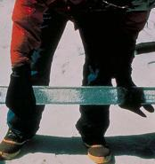

<center>

{ width=70% }

</center>


```{r setup, include=FALSE}
knitr::opts_chunk$set(echo = TRUE)
library(leaflet)
library(dplyr)
```

# Introduction

In this project, the data was taken from the NOAA Paleoclimatology online database and contains methane samples from ice cores from depths of 157 to 260 m. The researchers interested in this data collected it in order to model past atmospheric compositions. The data was collected by taking ice cores from ice in Antarctica and then measuring the concentration of methane (CH4) in parts per billion by volume (ppbv) in each sample. In this data is also given the estimated age of the sample. Since this is a quantity estimated from depth and not directly measured, the age of the sample will not be discussed in this project except to provide context for what a certain depth means. In general, methane (CH4) concentration decreases as depth of the sample increases. The goal of this project is to determine the relationship between sample depth (in meters) and methane concentration (in ppbv). 

<center>

{ width=70% }

</center>

The data for this project can be found at https://www.ncdc.noaa.gov/paleo-search/study/15076 in the TALOS DOME TALDICE dataset.

## The Data

```{r}
aic = read.csv('ANTICECOREnew.csv')


library(DT)
datatable(
  aic,filter = 'top', options = list(
  pageLength = 6, autoWidth = TRUE, editable = TRUE, dom = 'CH4',
    buttons = c('copy', 'csv', 'excel', 'pdf', 'print')),
caption = htmltools::tags$caption(
    style = 'caption-side: bottom; text-align: center;',
    'Table 2: ', htmltools::em('Above are given 23 measurements of the methane concentrations in ice cores along with their associated depth and estimated age. It should be noted that all variables, depth, age(though not used in this project), and methane concentration vary continuously.')
  )
) %>%
  formatStyle('D',  color = 'red', backgroundColor = 'orange', fontWeight = 'bold')


```


### Plot data

```{r}
library(ggplot2)
g = ggplot(aic, aes(x = D, y = CH4)) + geom_point() + ggtitle("CH4(ppbv) as a function of depth(m)")
g
```


## Data Collection

The data were collected by a team of researchers working in Antarctica and each datum was obtained by taking an ice core and then measuring the depth and methane concentration for each datum.

## The Story Behind the Data

This data represents a growing worldwide effort to understand earth's past weather and climate and the changes it underwent, to contextualize and better understand the changes going on in earth's climate today. This data begins at a depth of 157 m, or approximately 1042 years ago, before any influence from anthropogenic factors such as the industrial burning of fossil fuels could contribute to concentration of methane in earth's atmosphere. This allows for a baseline for the way methane concentrations have changed in the past and presents a way to understand the changes going on around us today and to classify them as normal or abnormal. 

## Importance of the Data

This data was collected because methane is a powerful greenhouse gas in earth's atmosphere and understanding how its concentration has changed in the past allows us to understand and contextualize the change of methane's concentration today. In order to understand the change, the relationship of methane concentration to depth will be investigated.

## My Interest in the Data

I am interested in this data because it falls into the larger category of paleoclimatology. Paleoclimatology combines many of my research interests such as climate, climate change, archaeology, and history and is the career path I wish to pursue after obtaining my meteorology degree.

<center>

{ width=70% }

</center>

## Problem to be solved

I wish to solve the problem of how methane concentrations vary as a function of depth. Determining this relationship will allow for the extrapolation of what methane concentrations would be at depths that were not measured in this dataset but that fall within the range of measured depths.

# Theory behind constuction of linear model

From looking at the data, I believe that methane concentrations will generally decrease as depth of the sample increases. In order to show this, I am going to construct a linear model with depth in m as the independent variable and methane concentration in ppbv as the dependent variable.

Start with a previous understanding of linear models of the form $y_i=\mu+\epsilon_i$. Each $\epsilon$ helps to extrapolate the desired value for a given x value following the trends contained within this data. The x value has its own mean and variance, and we must assume the variances are approximately constant for a simple linear regression to be valid. The data must also vary according to a linear relationship in order for the linear model to be valid. The below is an equation that shows that each y value can be expressed as the expected value for y given an x value plus an $\epsilon$. 

$$
y_i=E(y_i|x_i)+\epsilon_i
$$

When we construct a linear model from the data, the equation takes on the form given below.

$$
y_i=\beta_0+\beta_1x_i+\epsilon_i
$$

Where $y_i$ is the expected value from the data, $\hat\beta_0+\hat\beta_1x_i$ is the model estimation for the expected value, and $\epsilon_i$ is the residual $r_i$. These residuals are crucial to simple linear regression as the line of best fit will be determined by minimizing the residuals. For any line through the data, the mean of the residuals is zero and they are distributed about 0 patternlessly. Using the Shapiro-Wilk test, we can check if these residuals actually have a normal distribution. Once we confirm the residuals are distributed normally, we calculate the standard deviation, $\beta_0$, and $\beta_1$ of our model for the data. Upon completing this, we will check the validity of out model by constructing a t-test to test the null hypothesis that our $\beta$ values are equal to 0, and as a result prove the validity of a linear model for our data

# Validity with mathematical expressions

Using the above theory, we will now apply this theory to our data.

## Checks on validity

### Straight trend line 

We begin with a plot to test if the data has a straight trend line.

```{r}
library(s20x)
trendscatter(CH4~D,f=0.5, data=aic)
aic.lm = lm(CH4~D, data = aic)
with(aic, 
plot(CH4~D,bg="Blue",pch=21,ylim=c(0.9*min(CH4),1.1*max(CH4)),xlim=c(0.9*min(D),1.1*max(D)),main=("Trendline for data"))
)
abline(aic.lm)
```

From the above graphs, it can be seen that the data follows a mostly straight-line relationship and is approximated well by the linear model placed over the data. Also, from the first plot, we can see that standard deviation for the dependent variable stays mostly constant throughout the data.


### Errors distributed Normally

$$\epsilon_i \sim N(0,\sigma^2)$$


```{r}
yhat=with(aic,predict(aic.lm,data.frame(aic)))
errordist=with(aic,sum(CH4-yhat))
errordist
```

The above error mean is so small that it can be considered essentially equal to zero, confirming the distribution of errors has a mean of 0.

#### Shapiro-wilk

Now, we check if the errors are distributed normally using a Shapiro-Wilk test.

```{r}
normcheck(aic.lm, shapiro.wilk = TRUE)
```

This test shows the residuals have a high P-value (0.784) for being distributed normally, and the graph of residuals also shows a roughly normal distribution suggesting that the errors (or residuals) are indeed distributed normally.

### Constant variance

Below, plots are given to show that the residuals have an essentially constant variance about zero.

#### Residual vs fitted values

Below are plotted the residuals against the fitted values.

```{r}
height.res=residuals(aic.lm)
height.fit=fitted(aic.lm)
plot(height.fit,height.res,main=("Residuals vs. Fitted values"))
```

#### trendscatter on Residual Vs Fitted

Below is given a trendline for the residuals compared to the fitted values.

```{r}
trendscatter(height.res~height.fit)
```

Both these plots of the residuals show that there is not any significant trend in the distribution of the residuals about 0, contributing to the evidence that a linear model is valid for this data.

### Zero mean value of $\epsilon$

From the Shapiro-Wilk test, the sum of the residuals, and the above plots of the residuals, I conclude that $\epsilon$ does indeed have a mean of zero.

### Independence of data 

Since each ice core was taken individually and then analyzed separately, there is little reason to believe that one sample could have affected the methane values from the other samples. Also, due to the extreme cold temperatures, each core's methane gas was trapped inside and would not have been able to escape to affect the concentrations in other samples.

# Model selection 

Given that the above model was shown to be valid for the data, I have selected a linear model to show how methane concentrations vary with depth.

```{r}
summary(aic.lm)
```


## Adjusted $R^2$ 

$$R_{adj}^2 = 0.811$$


# Analysis of the data

Using the above model, we can extract additional info from the linear model.

## Plots of the data

Below is given a graph of the data with the fitted linear model and the residuals plotted.

```{r}
with(aic,
plot(CH4~D,bg="Blue",pch=21,ylim=c(0.9*min(CH4),1.1*max(CH4)),xlim=c(0.9*min(D),1.1*max(D)),main=("Methane Concentration (ppbv) vs. Depth (m) w/ Trendline and Residuals"))
)
abline(aic.lm)
yhat=with(aic,predict(aic.lm,data.frame(aic)))
with(aic,{segments(D,CH4,D,yhat)})
abline(aic.lm)
```

This shows the power of the linear model in predicting CH4 concentrations at a given depth.

## Summary lm object

```{r}
summary(aic.lm)
```

From this we can give the equation of the linear model:

$$ CH_4 = 753.0880 - 0.6028D$$

Where $CH_4$ is the concentration of methane in ppbv and D is the depth the sample was taken from in m.

The multiple R-squared means that our model account for 81.97% of the variation of the dependent variable in the data. The values listed above, for the linear model are the point values for the true linear model of the population this dataset was taken from.


## Calculate cis for $\beta$ parameter estimates

```{r}
ciReg(aic.lm, conf.level = .95)
```

The 95% confidence interval for the intercept ($\beta_0$) is 726.7320 to 779.4441 ppbv CH4 and -0.7312 to -0.4745 ppbv CH4/m for the slope ($\beta_1$).

Using our model, we can also make prediction for methane concentrations. Our model is only valid inside the range of depths that the model was constructed for. Below, we find the predicted CH4 concentrations for depths of 175 and 225 m.

```{r}
predict(aic.lm, data.frame(D=c(175,225)))
```

From our model, we can predict a value of 647.5899 and 617.4476 ppbv CH4 for ice cores taken from depths of 175 and 225 m respectively.

### Check on outliers using cooks plots

Below, a Cook's plot is given, a powerful way of finding outliers and thus improving the linear model.

```{r}
cooks20x(aic.lm)
```

Now, we make a new linear model without the outliers.

```{r}
aic2 = aic[-2,-6,-21]
aic2.lm = lm(CH4~D, data = aic2)
with(aic2, 
plot(CH4~D,bg="Blue",pch=21,ylim=c(0.9*min(CH4),1.1*max(CH4)),xlim=c(0.9*min(D),1.1*max(D)),main=("CH4 vs. D after removing outliers"))
)
abline(aic2.lm)
summary(aic2.lm)
```

Above is given a plot of the data after removing the outliers along with a summary of the new linear model. There is a marginal improvement in the multiple R-squared, but I do not think this justifies the removal of 3 data points from an already small dataset.

# Conclusion

In conclusion, there is a strong linear relationship between methane concentration and sample depth over the specified sample time period and depth. The relationship has been proven valid for all expected qualities of a simple linear relationship and allows for extrapolation of CH4 concentrations for depths within the dataset. Using the linear model to see what methane concentrations would look like today without the influence of anthropogenic factors is possible, but might not give a totally accurate picture. Extrapolations outside the given range of depths should be made with caution as this model is only valid for the given range of depths and associated time period as atmospheric phenomenon such as methane concentration are always fluctuating and open to change.

## Answering the research question

From this project, I have determined that from a depth of approximately 157 to 260 m, methane concentrations exhibit a linear relationship with depth. These depths are associated with a period of approximately 1500 years from 2500 to 1000 years ago. The linear relationship tells us that some natural environmental factor caused methane to increase linearly over this period. What this process might be is out of the scope of this project.

## Suggest ways to improve model or experiment

To improve the model over the given time period, I think taking additional ice core samples from different locations would help to improve the accuracy of the linear model. I do not think that any other model would be appropriate for the range of depths I examined in this project. However, looking outside of that narrow range of depths, we see the graph given below.

```{r}
aicfull = read.csv('ANTICECOREfull.csv')
trendscatter(CH4~D,f=0.5, data=aicfull)
```

Here, we see the trend of methane concentrations at depths down to 1.4 km or approximately 150,000 years ago. Though there is a general decreasing trend with depth, it does not demonstrate a true linear relationship or any simple relationship that could easily be modeled. This represents the complexity of how atmospheric variables can change over large time scales and the difficulty in measuring them. While this entire period might not be able to be characterized by any one equation or model, reducing the time scale by two orders of magnitude (from 150,000 to 1,500 years) allows us to demonstrate a period of time where methane concentrations increased linearly along with ice level build-up in Antarctica. This shows the principle that while the atmosphere as an entire system may appear chaotic when looking at large scales, taking individual "slices" for research purposes allows for the creation of models that make good approximations in their respective domains. 

# References

“Ice Core.” National Centers for Environmental Information, www.ncdc.noaa.gov/sites/default/files/styles/full_page_width/public/icecore-measure.jpg?itok=b7aPvWcf. 

Tree Ring. tse1.mm.bing.net/th?id=OIP.HfvC7DW_DGtRr8l8RfRdjwAAAA&amp;pid=Api.   

L. Bazin, A. Landais, B. Lemieux-Dudon, H. Toyé Mahamadou Kele, D. Veres, F. Parrenin, P. Martinerie, C. Ritz, E. Capron, V. Lipenkov, M.-F. Loutre, D. Raynaud, B. Vinther, A. Svensson, S.O. Rasmussen, M. Severi, T. Blunier, M. Leuenberger, H. Fischer, V. Masson-Delmotte, J. Chappellaz, and E.Wolff. 2013. An optimized multi-proxy, multi-site Antarctic ice and gas orbital chronology (AICC2012): 120-800 ka. Climate of the Past, Vol. 9, Issue 4, pp. 1715-1731. DOI: 10.5194/cp-9-1715-2013


